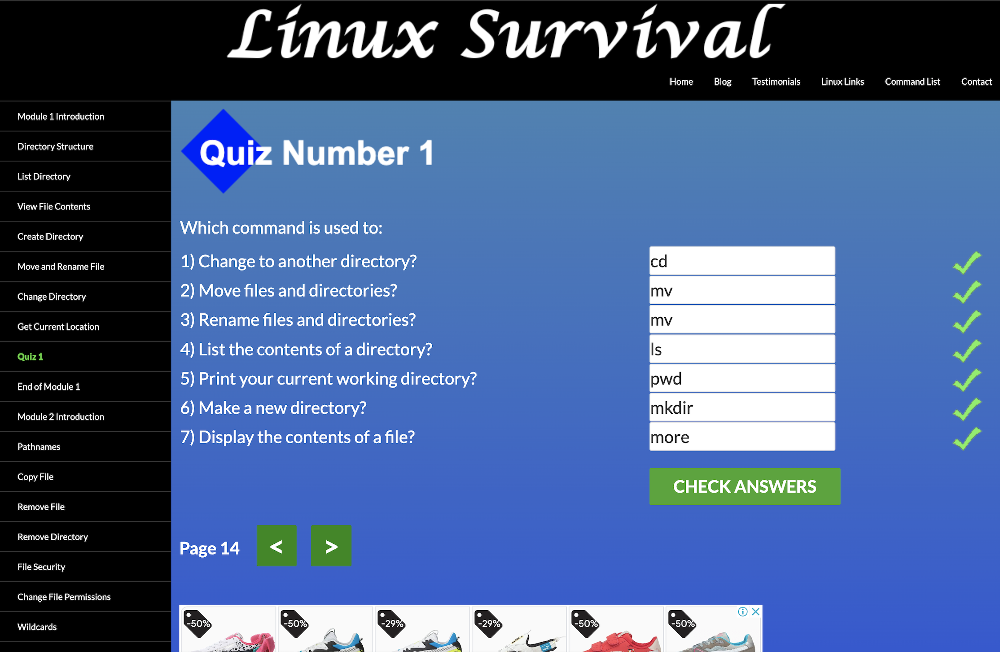
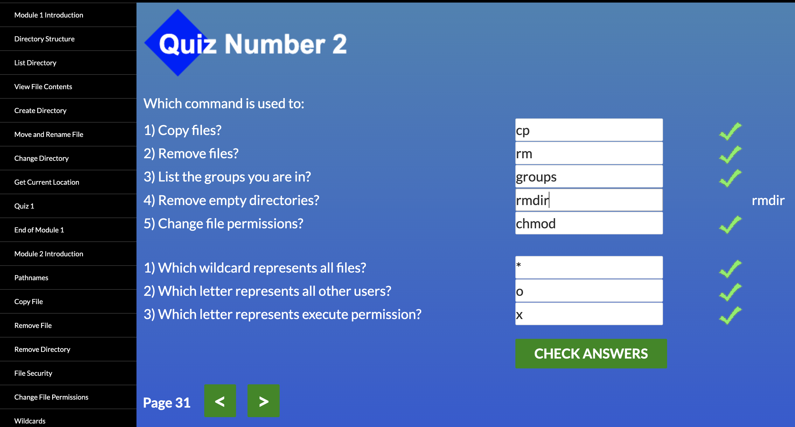
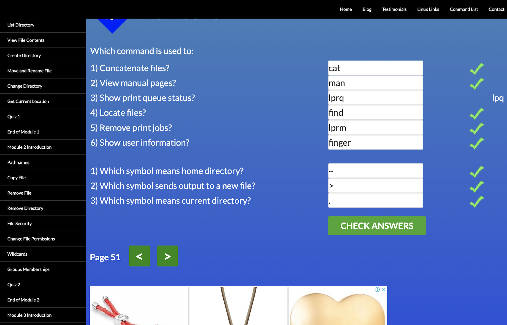
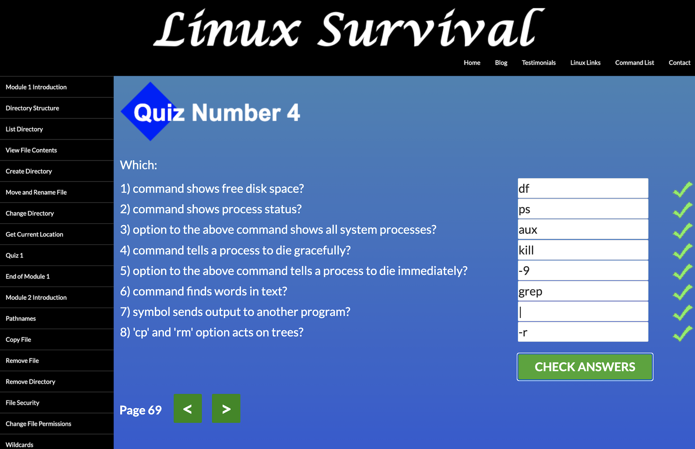
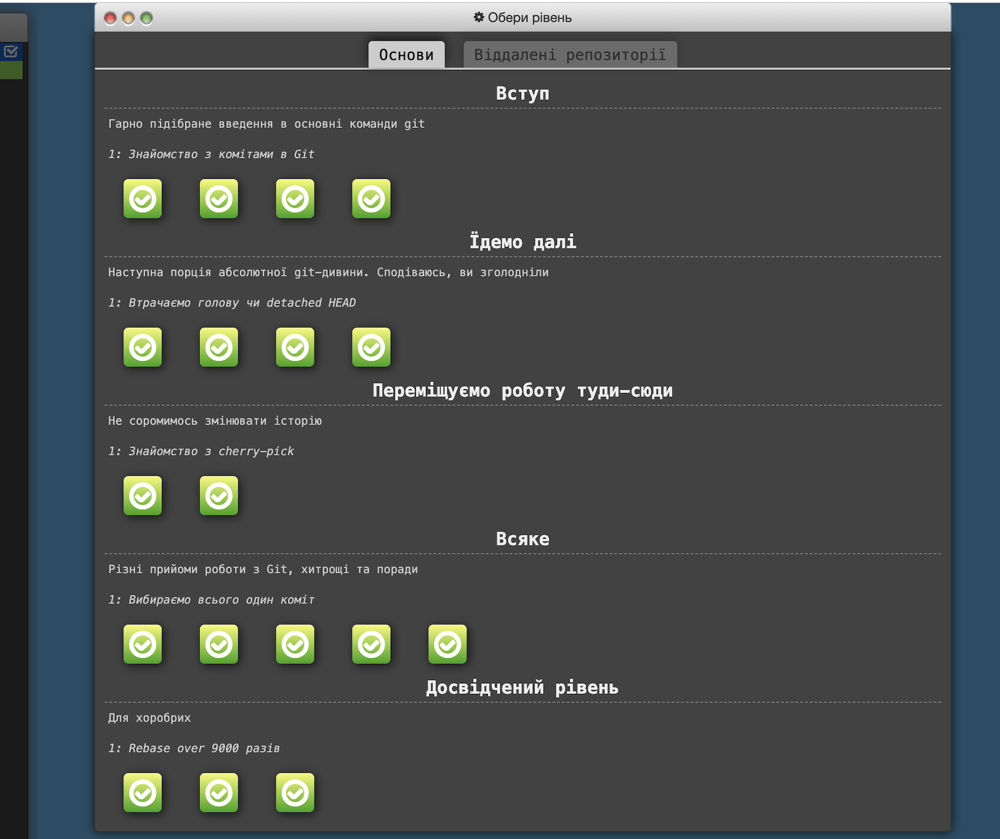
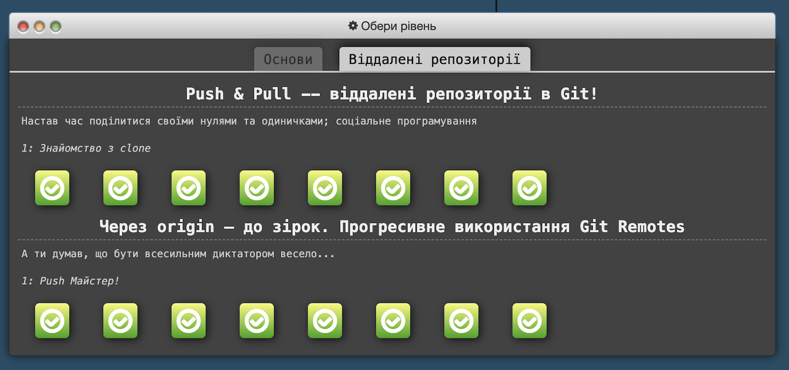
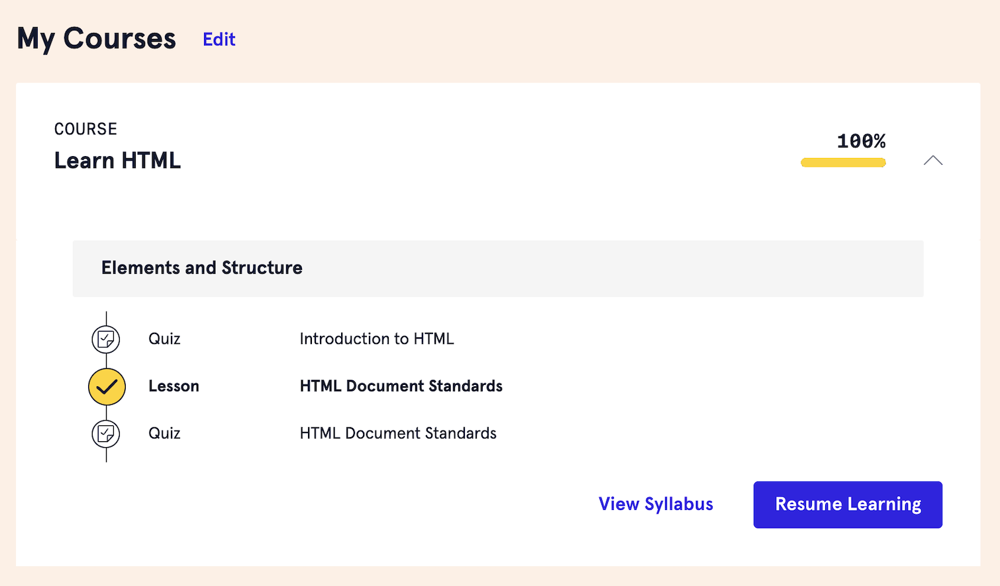
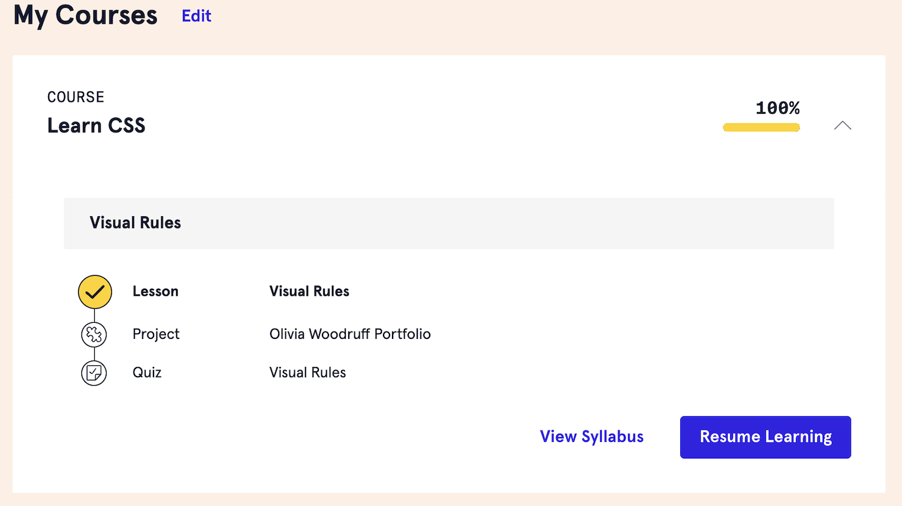
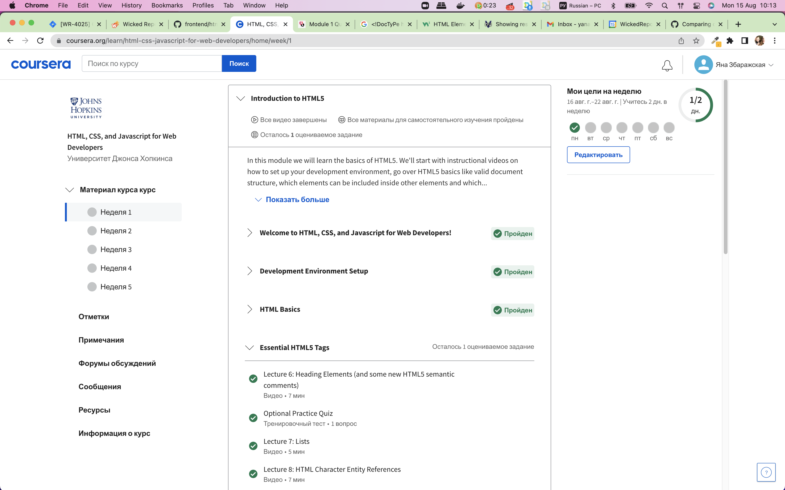
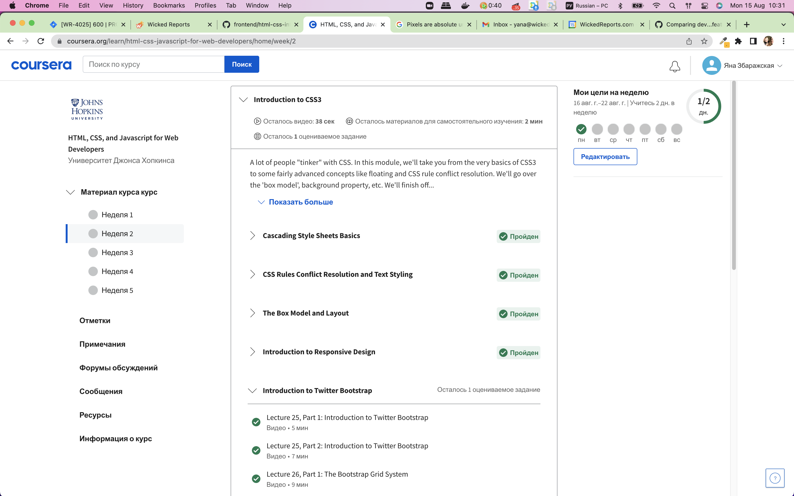

## Welcome!
Меня зовут Яна. Прохожу курс для подкрепления знаний по front-end.

## Stage 0
- [x] Git Basics
- [x] Linux CLI, and HTTP

## Linux CLI, and HTTP
Скрины можно увидеть по клику на кнопку ниже:

### Review Linux CLI, and HTTP
Можно всегда вернуться и найти в Google или своих записях нужную команду. 
Использую обычно терминал PhpStorm - для работы этого было достаточно. С Linux ранее не работала.
Закрепила уже какие-то знания. Новые, более сложные команды, пока могут и не пригодиться.

## Git Collaboration

### Review Git Collaboration
Много команд, довольно долго проходить. 
Далеко не все команды использую в работе. Возможно, сделала б этот момент по желанию, а не обязательным пунктом.

## Intro to HTML and CSS

### Review HTML and CSS
Знакома со всем. Удивил момент с вертикальными margin - не обращала внимание раньше на их свойство collapse, если они соприкасаются.
